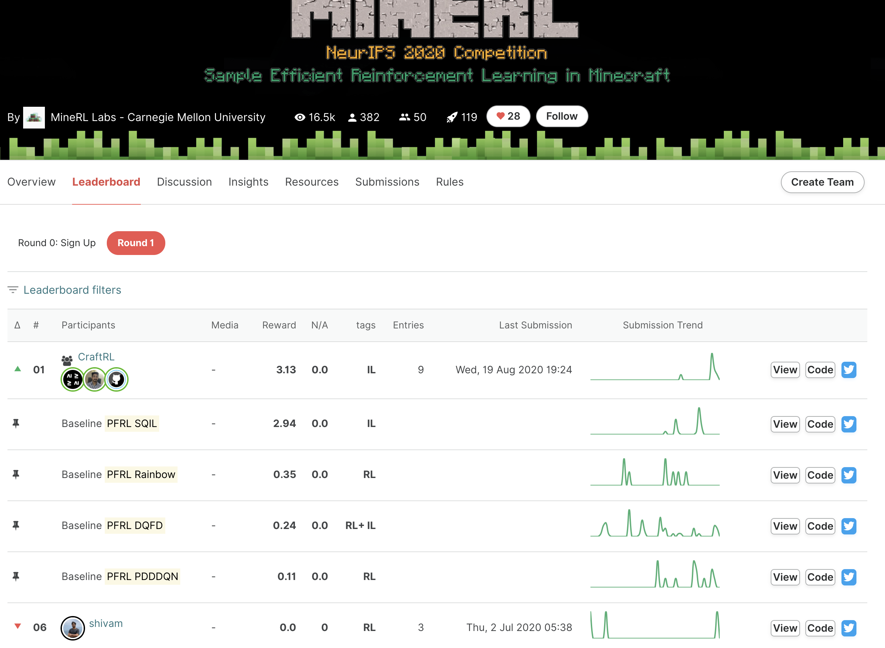

# NeurIPS 2020: MineRL Competition Rainbow Baseline with PFRL

This repository is a **Rainbow baseline submission example with [PFRL](https://github.com/pfnet/pfrl)**,
originated from [the main MineRL Competition submission template and starter kit](https://github.com/minerllabs/competition_submission_template).

For detailed & latest documentation about the competition/template, see the original template repository.

This repository is a sample of the "Round 1" submission, i.e., the agents are trained locally.  

`test.py` is the entrypoint script for Round 1.  
Please ignore `train.py`, which will be used in Round 2.

`train/` directory contains baseline agent's model weight files trained on `MineRLObtainDiamondDenseVectorObf-v0`.

## List of current baselines
- [Rainbow](https://github.com/keisuke-nakata/minerl2020_submission) <-- We are here
- [SQIL](https://github.com/s-shiroshita/minerl2020_sqil_submission)
- [DQfD](https://github.com/marioyc/minerl2020_dqfd_submission)
- [PDDDQN]https://github.com/ummavi/minerl2020_submission

# How to Submit

After [signing up the competition](https://www.aicrowd.com/challenges/neurips-2020-minerl-competition), specify your account data in `aicrowd.json`.
See [the official doc](https://github.com/minerllabs/competition_submission_template#what-should-my-code-structure-be-like-)
for detailed information.

Then you can create a submission by making a tag push to your repository on https://gitlab.aicrowd.com/. Any tag push (where the tag name begins with "submission-") to your repository is considered as a submission.


If everything works out correctly, you should be able to see your score on the
[competition leaderboard](https://www.aicrowd.com/challenges/neurips-2020-minerl-competition/leaderboards).




# About Baseline Algorithm

This baseline consists of two main steps:

1. [Apply K-means clustering](https://minerl.io/docs/tutorials/k-means.html) for the action space with the demonstration dataset.
2. Apply Rainbow algorithm on the discretized action space.

Each of steps utilizes existing libraries.  
K-means in the step 1 is from [scikit-learn](https://scikit-learn.org/stable/modules/generated/sklearn.cluster.KMeans.html#sklearn.cluster.KMeans),
and Rainbow in the spte 2 is from [PFRL](https://github.com/pfnet/pfrl),
which is a Pytorch-based RL library.


# How to Train Baseline Agent on your own

`mod/` directory contains all you need to train agent locally:

```bash
pip install numpy scipy scikit-learn pandas tqdm joblib pfrl

# Don't forget to set this!
export MINERL_DATA_ROOT=<directory you want to store demonstration dataset>

python3 mod/dqn_family.py \
  --gpu 0 --env "MineRLObtainDiamondDenseVectorObf-v0"  \
  --outdir result \
  --noisy-net-sigma 0.5 --arch distributed_dueling --replay-capacity 300000 --replay-start-size 5000 --target-update-interval 10000 \
  --num-step-return 10 --agent CategoricalDoubleDQN --monitor --lr 0.0000625 --adam-eps 0.00015 --prioritized --frame-stack 4 --frame-skip 4 \
  --gamma 0.99 --batch-accumulator mean

```


# Team

The quick-start kit was authored by 
**[Shivam Khandelwal](https://twitter.com/skbly7)** with help from [William H. Guss](http://wguss.ml)

The competition is organized by the following team:

* [William H. Guss](http://wguss.ml) (Carnegie Mellon University)
* Mario Ynocente Castro (Preferred Networks)
* Cayden Codel (Carnegie Mellon University)
* Katja Hofmann (Microsoft Research)
* Brandon Houghton (Carnegie Mellon University)
* Noboru Kuno (Microsoft Research)
* Crissman Loomis (Preferred Networks)
* Keisuke Nakata (Preferred Networks)
* Stephanie Milani (University of Maryland, Baltimore County and Carnegie Mellon University)
* Sharada Mohanty (AIcrowd)
* Diego Perez Liebana (Queen Mary University of London)
* Ruslan Salakhutdinov (Carnegie Mellon University)
* Shinya Shiroshita (Preferred Networks)
* Nicholay Topin (Carnegie Mellon University)
* Avinash Ummadisingu (Preferred Networks)
* Manuela Veloso (Carnegie Mellon University)
* Phillip Wang (Carnegie Mellon University)


 

  

    
